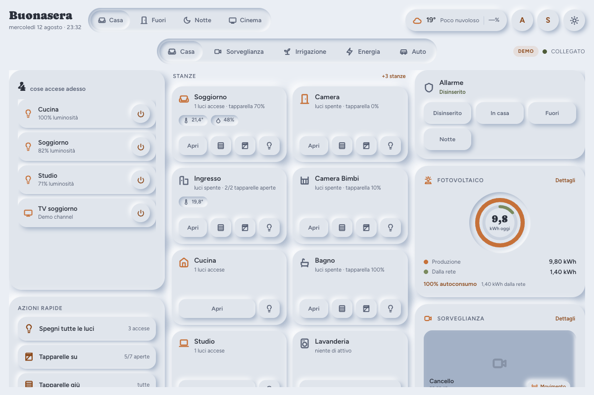

<!-- title: Live Dashboard -->
# Live Dashboard

*[Read in English](README.md)*

Una dashboard per Home Assistant scritta a mano, a pagina singola, pensata
per un tablet a muro: stanze, allarme, meteo e azioni rapide in un'unica
schermata, con le view opzionali Energia e Irrigazione. Nessuna card
Lovelace, nessuna dashboard YAML — legge le stanze e le entità direttamente
dai registri di Home Assistant e si costruisce da sola.



**Provala senza installare nulla:** clona questo repo e apri
`public/dash_neumo.html?demo` in un browser — funziona anche da `file://`,
senza bisogno di Home Assistant. Mostra dati inventati e un badge `DEMO`;
vedi [Modalità demo](#modalità-demo) più sotto.

## Cos'è, e cosa non è

- Una pagina singola che vive in un proprio pannello `panel_custom`, non una
  dashboard Lovelace e non una card. Non cerca di essere nessuna delle due.
- Pensata per un **tablet a muro, in orizzontale**, a una dimensione fissa
  di circa 1200×800 senza scroll nella view Casa — è un vincolo voluto (vedi
  "Modalità kiosk" più sotto), non un difetto.
- La pagina mobile (`dash_neumo_mobile.html`) è un secondo layout completo
  per telefono, ma è secondario: le scelte di design (densità della griglia,
  niente scroll) sono pensate prima di tutto per il tablet a muro.

## Requisiti

- Home Assistant con accesso a `www/` (per copiare i file in `config/www/`)
  e un `configuration.yaml` modificabile per l'integrazione `panel_custom`.
- Nessuna versione minima imposta, ma le chiamate ai registri area/device/
  entity usate qui (`config/area_registry/list` ecc.) sono standard da Home
  Assistant 2022.x in poi; qualunque versione ragionevolmente recente va bene.
- Niente npm, niente build step. Solo HTML/CSS/JS semplice, caricato come
  moduli ES direttamente da `config/www/`.

## Installazione

1. Copia l'intera cartella `public/` in `config/www/casa/` (il nome è
   arbitrario — `casa` è solo l'esempio usato qui sotto).
2. Aggiungi a `configuration.yaml`:

   ```yaml
   panel_custom:
     - name: casa-panel
       url_path: casa
       sidebar_title: Casa
       sidebar_icon: mdi:home-heart
       module_url: /local/casa/panel.js
       embed_iframe: true
       trust_external_script: false
   ```

3. Riavvia Home Assistant. Apri la nuova voce nella sidebar.

Fatto — senza nessun `config.js`, la dashboard scopre da sola le tue aree e
ne mostra fino a 8 come tessere stanza, più le eventuali entità `person.*` e
la prima `weather.*` che trova. Allarme, selettore di modalità casa,
Energia, Irrigazione e Auto restano nascosti finché non li attivi (vedi
sotto) — non c'è modo di indovinare l'accoppiata giusta per uno script
"modalità casa", né quale, tra più pannelli allarme, sia "quello giusto":
per questo restano spenti di default invece di tentare a caso.

### Configurare il resto

Copia `config.example.js` in `config.js` **nella stessa cartella** (accanto
a `panel.js`) e scommenta quello che ti serve — ogni chiave è documentata
in linea nel file. `config.js` è pensato per contenere i tuoi entity ID:
tienilo fuori dal controllo di versione (il `.gitignore` fornito lo esclude
già).

## Attivare l'Energia

Il blocco `energy` di `config.js` chiede i sensori per **ruolo**, non per
marca, quindi funziona con qualunque integrazione li esponga.
`productionToday` / `gridToday` devono essere contatori giornalieri che si
azzerano a mezzanotte — vedi TROUBLESHOOTING.md se i grafici sembrano sbagliati.

| Ruolo | Huawei FusionSolar | SolarEdge | Fronius | Shelly EM | Energy Dashboard di HA |
| --- | --- | --- | --- | --- | --- |
| `production` | `sensor.*_panel_production_power` | `sensor.solaredge_current_power` | `sensor.inverter_power` | `sensor.shellyem_channel_a_power` | `sensor.solar_power` (tuo) |
| `consumption` | `sensor.*_house_load_power` | — (serve un utility meter) | — | `sensor.shellyem_channel_b_power` | `sensor.house_power` |
| `gridImport` | `sensor.*_grid_consumption_power` | `sensor.solaredge_m1_ac_power` (lato prelievo) | `sensor.meter_power` | `sensor.shellyem_channel_b_power` | il tuo sensore di prelievo |
| `gridExport` | `sensor.*_grid_injection_power` | stesso contatore, lato immissione | `sensor.meter_power` (negativo) | lo stesso, invertito | il tuo sensore di immissione |
| `productionToday` | `sensor.*_panel_production_today` | `sensor.solaredge_lifetime_energy` (diff) | `sensor.energy_day` | Shelly EM non ha un contatore giornaliero — aggiungi un helper `utility_meter` | `sensor.solar_energy_today` |
| `gridToday` | `sensor.*_grid_consumption_today` | via un helper `utility_meter` | `sensor.grid_energy_day` | via un helper `utility_meter` | `sensor.grid_import_today` |
| `battery` | `sensor.*_battery_soc` / `_power` | integrazione SolarEdge Battery | sensori batteria Fronius | — | — |
| `inverterStatus` | `sensor.*_inverter_inverter_status` | `sensor.solaredge_status` | `sensor.status_code` | — | — |

Se la tua integrazione non espone un contatore giornaliero per un ruolo,
aggiungi un helper
[`utility_meter`](https://www.home-assistant.io/integrations/utility_meter/)
in Home Assistant che si azzeri ogni giorno e punta `config.js` su quello.

## Attivare l'Irrigazione

Ogni zona è già utile con solo `moisture` (un `sensor.*` con stato in `%`) e
`valve` (uno `switch.*`): sparkline, stato valvola e pulsanti a durata che si
limitano a chiamare `switch.turn_on` e poi `switch.turn_off` dopo N minuti —
nessuna entità helper aggiuntiva richiesta per questa parte.

Tutto il resto (`advisory`, `deficit`, `weekMm`, `lastRun`, `et0`, `etc`,
`effectiveRain`, `summary`) è opzionale e compare solo se lo imposti.
**La parte agronomica (ET₀/ETc, deficit accumulato) non fa parte di questo
progetto**: dipende dalla tua stazione meteo e dai tuoi dati di suolo. Le
automazioni che la calcolano nell'installazione originale da cui è nata
questa dashboard sono una configurazione personale e non sono incluse qui;
costruisci le tue (qualunque automazione che scriva il risultato in un
`input_number`/`sensor` e lo punti da `config.js` funziona), oppure lascia
questi campi non impostati e usa la dashboard solo per l'umidità in tempo
reale e l'irrigazione manuale.

## Auto (opzionale)

Non esiste un dominio Home Assistant che standardizzi la telematica
veicolare, quindi `config.vehicle` è una mappatura esplicita campo per campo
(carburante o batteria, autonomia, contachilometri, celle extra,
binary_sensor di avviso). È stata usata con un'installazione Mercedes
`mbapi2020`; dovrebbe funzionare con qualunque integrazione esponga sensori
comparabili (Volvo, Kia Connect, BMW Connected Drive, lettori OBD-II
generici), dato che qui non c'è nulla di specifico per una marca.

## Telecamere (opzionale)

Auto-discovery completo da ogni entità `camera.*` che Home Assistant
espone — area dal registry, movimento da un `binary_sensor` con
`device_class: motion` sullo stesso device. `config.cameras` sovrascrive
solo le eccezioni (vedi `config.example.js`); non c'è nessun elenco di
telecamere da mantenere a mano.

- **Anteprime, non video.** Ogni tessera mostra uno snapshot da
  `entity_picture` (l'URL che Home Assistant firma già da solo), ricaricato
  ogni `snapshotInterval` secondi (10 di default). Il refresh si sospende
  quando la scheda/pagina non è visibile.
- **Live al tap.** Toccare un'anteprima apre uno stream MJPEG a schermo
  intero (lo stesso URL firmato, con `/api/camera_proxy/` sostituito da
  `/api/camera_proxy_stream/`) — niente `hls.js`, niente WebRTC, niente
  build step. Si chiude da sola dopo 2 minuti, o al tap.
- **Privacy per le telecamere interne**: elenca un entity_id in
  `hideUntilTap` e la sua tessera mostra solo un'icona — nessuna anteprima
  caricata — finché qualcuno non la tocca una volta per vedere lo snapshot,
  e una seconda per andare live. Pensata per una telecamera puntata su un
  corridoio dove vive lo stesso tablet.
- La tab "Sorveglianza" compare solo da **due telecamere in su** — con una
  sola, la card in Casa e il suo overlay a schermo intero al tap sono già
  tutta la funzione: una tab con una tessera sola non aggiungerebbe nulla.
  Oltre `gridTab` telecamere (6 di default) la griglia della tab passa da 2
  a 3 colonne.
- Funziona solo su `panel_custom` (vedi "Cos'è, e cosa non è" sopra): gli
  URL di snapshot/stream sono firmati da HA e same-origin col pannello, che
  è esattamente ciò che un'eventuale variante standalone/token dovrebbe
  gestire diversamente.

## Modalità kiosk per il tablet a muro

Punta [Fully Kiosk Browser](https://www.fully-kiosk.com/) (o un altro
browser kiosk) su `https://<tuo-ha>/casa`. Per nascondere sidebar e header
di Home Assistant sopra al pannello, usa
[kiosk-mode](https://github.com/NemesisRE/kiosk-mode) da HACS, oppure le
impostazioni immersive/zoom di Fully Kiosk. Risoluzione di riferimento
1280×800 orizzontale — sotto quella larghezza o altezza la view Casa passa a
un layout scorrevole (voluto — vedi TROUBLESHOOTING.md).

## Modalità demo

Apri la pagina con `?demo` in coda all'URL (oppure aprila direttamente fuori
da `panel_custom` — da `file://` la dashboard non ha nessun host con cui
parlare e passa da sola allo stesso backend demo dopo un breve timeout).
Mostra tutte le view — Casa, Sorveglianza, Irrigazione, Energia, Auto — con
dati inventati e un badge `DEMO` visibile, e non chiama mai un servizio
reale. Le telecamere demo mostrano solo l'icona segnaposto (non c'è un feed
vero da inventare), compresa una impostata `hideUntilTap` per far vedere
anche quel comportamento.

## Limiti noti

- **Il risultato vale quanto le tue aree assegnate.** Ogni stanza,
  dispositivo e telecamera su questa dashboard viene dai registri di
  Home Assistant (aree/dispositivi/entità) — non c'è nessuna logica di
  raggruppamento o denominazione alternativa oltre a quella. Se la tua
  installazione ha le aree assegnate con coerenza, la dashboard ha già
  senso al primo avvio, senza scrivere una riga di config. Se non hai mai
  assegnato le aree — tutto resta sotto "nessuna area", come capita spesso
  a un'installazione appena fatta — la dashboard sembrerà quasi vuota, e
  non è un bug da segnalare: è `Impostazioni -> Aree` di Home Assistant che
  aspetta di essere compilato, cosa che questa dashboard non può indovinare
  al posto tuo.
- Pensata prima di tutto per un tablet a muro in orizzontale; la pagina
  mobile è completa ma secondaria, non l'obiettivo primario del design.
- Non sostituisce Lovelace: nessun selettore di card, nessun layout
  drag-and-drop, nessuna dashboard YAML. È una pagina che riflette i tuoi
  registri.
- `panel_custom` è l'unico metodo di installazione supportato in questa
  release — vedi CHANGELOG.md.

## Altro

- [TROUBLESHOOTING.md](TROUBLESHOOTING.md) — pannello bianco, stanze vuote,
  grafici sbagliati, allarme senza pulsanti. (In inglese.)
- [CHANGELOG.md](CHANGELOG.md)
- [config.example.js](public/config.example.js) — ogni opzione, documentata
  in linea.
