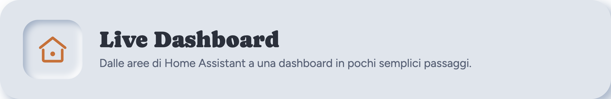

<!-- title: Live Dashboard -->


# Live Dashboard

[](https://github.com/mbonny95/live_dashboard/releases)
[](LICENSE)
[](#requirements)

*[Leggi in italiano](README.it.md)*

A hand-written, single-page Home Assistant dashboard for a wall-mounted
tablet: rooms, alarm, weather and quick actions on one screen, with optional
Energy and Irrigation views. No Lovelace cards, no YAML dashboard config — it
discovers your rooms and entities from Home Assistant's own registries and
draws itself.


**Try it without installing anything:** clone this repo and open
`public/dash_neumo.html?demo` in a browser — works straight from `file://`,
no Home Assistant required. It shows invented data and a `DEMO` badge; see
[Demo mode](#demo-mode) below.

## What this is, and isn't

- A single page that lives in its own `panel_custom` panel, not a Lovelace
  dashboard and not a card. It doesn't try to be either.
- Built for a **tablet mounted on a wall, in landscape**, at a fixed
  1200×800-ish size with no scrolling on the main Casa view — that constraint
  is deliberate (see "Kiosk mode" below), not a bug.
- The mobile page (`dash_neumo_mobile.html`) is a real, complete second layout
  for phones, but it's secondary: the design decisions (grid density, no
  scroll) are made for the wall tablet first.

## Requirements

- Home Assistant with `www/` access (to copy files into `config/www/`) and
  a `configuration.yaml` you can edit for the `panel_custom` integration.
- No minimum version is enforced, but the area/device/entity registry calls
  this uses (`config/area_registry/list` etc.) have been standard since
  Home Assistant 2022.x; anything reasonably current works.
- No npm, no build step. Everything is plain HTML/CSS/JS, loaded as ES
  modules straight from `config/www/`.

## Installation

1. Copy the whole `public/` folder into `config/www/casa/` (rename as you
   like — `casa` is just what the example below uses).
2. Add to `configuration.yaml`. **`name:` must be `<folder>-panel`** — the
   panel element registers itself under that exact tag, derived from the
   folder you copied it into, so it has to match or the panel loads as a
   blank/black screen with nothing in the browser console. This also means
   you can run a second copy side by side under a different folder (e.g.
   `casa2/` while trying this out, without touching a working `casa/`
   install) — just give it its own `name`/`url_path` pointing at that folder:

   ```yaml
   panel_custom:
     - name: casa-panel
       url_path: casa
       sidebar_title: Casa
       sidebar_icon: mdi:home-heart
       module_url: /local/casa/panel.js?v=1
       embed_iframe: true
       trust_external_script: false
   ```

   The `?v=1` on `module_url` matters more than it looks: `/local/` is
   served with long cache headers, and browsers cache ES modules
   particularly aggressively — a plain hard refresh doesn't reliably force
   a re-fetch of `panel.js` itself. Bump that number (`?v=2`, `?v=3`, …)
   every time you update the files in this folder, or you may keep running
   a stale `panel.js` with no error to show for it.
3. **Restart Home Assistant** — `panel_custom` entries are registered at
   startup, not hot-reloadable, so editing `configuration.yaml` alone has no
   effect until you restart. Then open the new sidebar entry.

That's it — with no `config.js` at all, the dashboard auto-discovers your
areas and shows up to 8 of them as room tiles, plus any `person.*` entities
and the first `weather.*` entity it finds. Alarm, house-mode scene switcher,
Energy, Irrigation and Vehicle stay hidden until you opt into them (see
below) — there's no way to guess a "house mode" script pairing or which of
several alarm panels is "the" one, so those stay off by default rather than
guessing wrong.

### Configuring the rest

Copy `config.example.js` to `config.js` **in the same folder** (next to
`panel.js`) and uncomment what you need — every key is documented inline
there. `config.js` is meant to hold your own entity IDs; keep it out of
version control (the provided `.gitignore` already excludes it).

## Enabling Energy

`config.js`'s `energy` block asks for sensors by **role**, not by brand, so
it works with anything that exposes these. `productionToday` /
`gridToday` must be daily counters that reset at midnight — see
TROUBLESHOOTING.md if the charts look wrong.

| Role | Huawei FusionSolar | SolarEdge | Fronius | Shelly EM | HA Energy Dashboard |
| --- | --- | --- | --- | --- | --- |
| `production` | `sensor.*_panel_production_power` | `sensor.solaredge_current_power` | `sensor.inverter_power` | `sensor.shellyem_channel_a_power` | `sensor.solar_power` (your own) |
| `consumption` | `sensor.*_house_load_power` | — (add a utility meter) | — | `sensor.shellyem_channel_b_power` | `sensor.house_power` |
| `gridImport` | `sensor.*_grid_consumption_power` | `sensor.solaredge_m1_ac_power` (import side) | `sensor.meter_power` | `sensor.shellyem_channel_b_power` | your grid import sensor |
| `gridExport` | `sensor.*_grid_injection_power` | same meter, export side | `sensor.meter_power` (negative) | same, inverted | your grid export sensor |
| `productionToday` | `sensor.*_panel_production_today` | `sensor.solaredge_lifetime_energy` (diffed) | `sensor.energy_day` | Shelly EM has no daily counter — add a `utility_meter` helper | `sensor.solar_energy_today` |
| `gridToday` | `sensor.*_grid_consumption_today` | via a `utility_meter` helper | `sensor.grid_energy_day` | via a `utility_meter` helper | `sensor.grid_import_today` |
| `battery` | `sensor.*_battery_soc` / `_power` | SolarEdge Battery integration | Fronius battery sensors | — | — |
| `inverterStatus` | `sensor.*_inverter_inverter_status` | `sensor.solaredge_status` | `sensor.status_code` | — | — |

If your integration doesn't expose a daily counter for a given role, add a
[`utility_meter` helper](https://www.home-assistant.io/integrations/utility_meter/)
in Home Assistant that resets daily and point `config.js` at that instead.

**The Fotovoltaico ring and its second row compare `productionToday` against
`gridToday` — production vs. energy *imported from the grid*, not total
house consumption.** If you're coming from a hand-built dashboard that paired
production against a "house load today" counter instead, expect a smaller,
different number here: grid import is only the part of consumption the grid
covered, not everything the house used. The schema only asks for these two
roles because they're the only daily counters guaranteed to exist across
integrations — a "house consumption today" counter isn't universal the way
FusionSolar's happens to be. If your integration does expose one and you
want that pairing instead, there's no config field for it in this release —
open an issue or adapt `dash_neumo*.html`'s energy section directly.

## Enabling Irrigation

Each zone needs only `moisture` (a `sensor.*` with `%` state) and a way to run
water to be useful: sparkline, valve state, and timed-run buttons. Two ways to
wire that second part, pick whichever matches your setup:

- `valve` — a `switch.*` this dashboard opens itself, calling
  `switch.turn_on` then `switch.turn_off` after N minutes. No extra helper
  entities required.
- `buttons` — one `input_button.*` per duration, for setups where a
  script/automation already owns the timing (e.g. a quick-action automation
  per duration) and there's no switch to drive directly. Takes over from
  `valve` if both are set.

Everything else (`advisory`, `deficit`, `weekMm`, `lastRun`, `et0`, `etc`,
`effectiveRain`, `summary`) is optional and only appears if you set it.
**The agronomic math (ET₀/ETc, accumulated deficit) is not part of this
project** — it depends on your own weather station and soil data. The
automations that compute it in the original installation this dashboard was
extracted from are a separate, personal setup and aren't included here;
build your own (any automation that writes the result into an
`input_number`/`sensor` and points `config.js` at it will work), or leave
those fields unset and use the dashboard for live moisture + manual watering
only.

## Vehicle (optional)

There's no Home Assistant domain that standardizes car telemetry, so
`config.vehicle` is an explicit field-by-field mapping (fuel or battery,
range, odometer, extra cells, warning binary_sensors). It's been used with a
Mercedes `mbapi2020` install; it should work with any integration that
exposes comparable sensors (Volvo, Kia Connect, BMW Connected Drive,
generic OBD-II readers) since nothing here is brand-specific.

## Appliances (optional)

Washer, dryer, or anything else where "is it running" matters more than a
plain on/off. No domain standardizes this either, so `config.appliances` is
an explicit list, each entry matched to a room by resolving its `status`
entity's own area (same rule as everything else — no separate room field to
fill in).

- `status` — any `sensor.*`/`binary_sensor.*`. Its raw state is shown as-is
  unless you map it through `stateLabels` (recommended for a text-state
  sensor like `sensor.washer_state`, whose vocabulary is entirely
  integration-specific — a `binary_sensor`'s `on`/`off` reads fine without
  one).
- `idleStates` — which states count as "not running" (defaults to
  `off`/`power_off`/`idle`/`unavailable`/`unknown`). Override it if your
  integration uses different words for idle.
- `remaining` (minutes) and `energyToday` are both optional and only shown
  in the state they're relevant for — remaining while running, energy while
  idle.
- `powerSwitch` is optional and only adds an off button — a switch being
  "on" isn't treated as "running" (a washer can stay powered between
  cycles), so it never drives what's shown. If set, that switch also stops
  being auto-discovered as a plain toggle in its room, since it'd otherwise
  show up twice.

Appliances that are running also appear in the Casa "on right now" list and
in the room summary, the same as lights or a vacuum in progress.

## Cameras (optional)

Fully auto-discovered from every `camera.*` entity Home Assistant reports —
area from the registry, motion from a `binary_sensor` with
`device_class: motion` on the same device. `config.cameras` only overrides
the defaults (see `config.example.js`); there's no per-camera list to
maintain.

- **Previews, not video.** Each tile shows a still snapshot from
  `entity_picture` (the URL Home Assistant already signs for you), reloaded
  every `snapshotInterval` seconds (10 by default). The refresh pauses while
  the browser tab/page isn't visible.
- **Live on tap.** Tapping a preview opens a fullscreen MJPEG stream (the
  same signed URL, `/api/camera_proxy/` swapped for
  `/api/camera_proxy_stream/`) — no `hls.js`, no WebRTC, no build step. It
  closes automatically after 2 minutes, or on tap.
- **Privacy for indoor cameras**: list an entity_id in `hideUntilTap` and its
  tile shows only an icon — no preview loads — until someone taps it once to
  reveal the still, and taps again to go live. Meant for a camera pointed at
  a hallway where the tablet itself lives.
- The "Sorveglianza"/"Surveillance" tab only appears with **2 or more**
  cameras — with exactly one, the Casa card and its tap-to-fullscreen
  overlay are already the whole feature, a tab with one tile wouldn't add
  anything. Above `gridTab` cameras (6 by default) the tab's grid switches
  from 2 to 3 columns.
- This only works over `panel_custom` (see "What this is, and isn't" above):
  the snapshot/stream URLs are HA-signed and same-origin with the panel,
  which is exactly what a future standalone/token variant would need to
  handle differently.

## Kiosk mode for the wall tablet

Point [Fully Kiosk Browser](https://www.fully-kiosk.com/) (or any kiosk
browser) at `https://<your-ha>/casa`. To hide the Home Assistant sidebar and
header on top of the panel, use
[kiosk-mode](https://github.com/NemesisRE/kiosk-mode) from HACS, or Fully
Kiosk's own "Web Content Zoom"/immersive settings. Target resolution
1280×800 landscape — anything narrower or shorter than that switches the
Casa view into a scrolling layout (deliberately — see TROUBLESHOOTING.md).

## Demo mode

Open the page with `?demo` appended to the URL (or just open it directly
outside of `panel_custom` — from `file://`, the dashboard has no host to
talk to and falls back to the same demo backend automatically after a short
timeout). It shows every view — Casa, Sorveglianza, Irrigazione, Energia,
Auto — with invented data and a visible `DEMO` badge, and never calls a real
service. The demo cameras show only their icon placeholder (there's no real
feed to fake), including one flagged `hideUntilTap` so you can see that
behavior too.

## Known limits

- **The result is only as good as your area assignments.** Every room,
  device and camera on this dashboard comes from Home Assistant's own
  area/device/entity registries — there's no fallback naming or grouping
  logic beyond that. If your installation has areas assigned consistently,
  it looks sensible the moment you open it, no config required. If you've
  never assigned areas — everything still lives under "no area" the way a
  fresh install often does — the dashboard will look almost empty, and
  that's not a bug to report: it's Home Assistant's own `Settings ->
  Areas` waiting to be filled in, not something this dashboard can guess
  for you.
- Built for a landscape wall tablet first; the mobile page is complete but
  secondary, not the primary design target.
- Not a Lovelace replacement — no card picker, no drag-and-drop layout, no
  YAML dashboard config. It's one page that reflects your registries.
- `panel_custom` is the only supported install method in this release — see
  CHANGELOG.md.

## More

- [TROUBLESHOOTING.md](TROUBLESHOOTING.md) — white panel, empty rooms, wrong
  charts, missing alarm buttons.
- [CHANGELOG.md](CHANGELOG.md)
- [config.example.js](public/config.example.js) — every override, documented
  inline.
